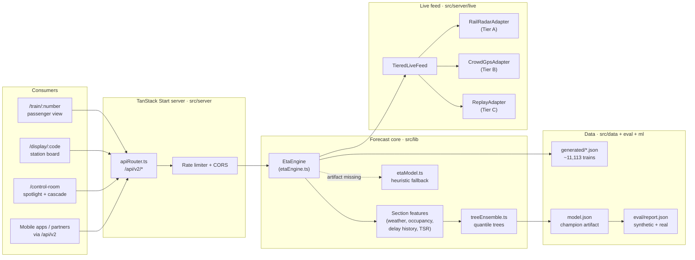
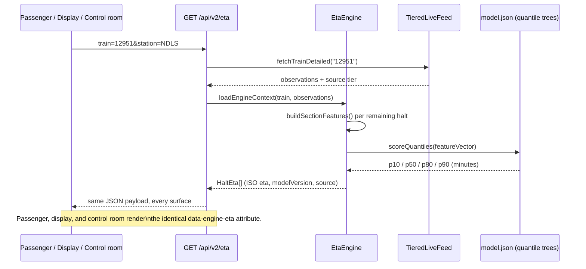
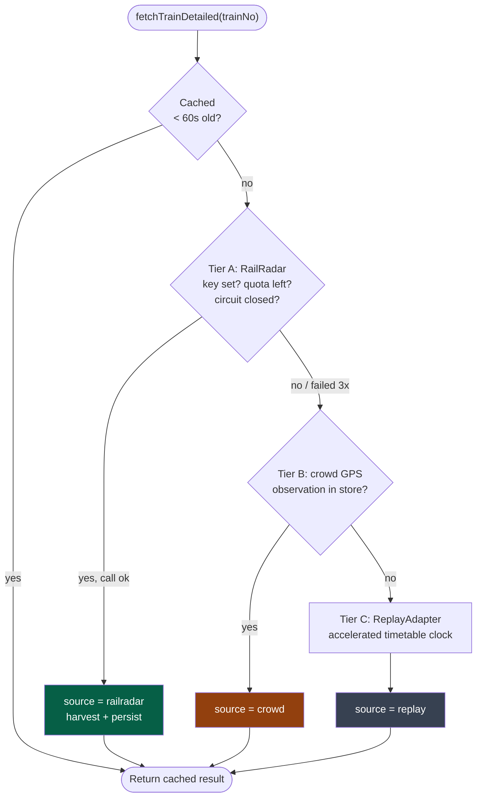
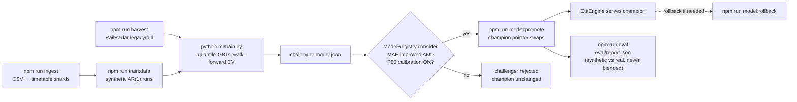

# RailDristhi

**ITS Indian Train System** — live running status and data-driven ETAs for Indian coaching trains.

The published timetable covers **~11,113 trains**. A sectional quantile model turns the remaining
path plus live conditions into P10 / P50 / P80 / P90 arrival times. The same engine feeds the
passenger page, station boards, the control room, and `/api/v2`.

Not a substitute for NTES or control-office running orders.

## Contents

- [What you can open](#what-you-can-open)
- [Architecture at a glance](#architecture-at-a-glance)
- [How a forecast is made](#how-a-forecast-is-made)
- [Request flow: one ETA, three screens](#request-flow-one-eta-three-screens)
- [Tiered live feed](#tiered-live-feed)
- [Training and continuous refinement](#training-and-continuous-refinement)
- [Project structure](#project-structure)
- [Quick start](#quick-start)
- [Environment](#environment)
- [API](#api)
- [Commands](#commands)
- [Tests that matter](#tests-that-matter)
- [Docs](#docs)

## What you can open

| URL             | What it is                                                                |
| --------------- | ------------------------------------------------------------------------- |
| `/`             | Search and network scale (five-digit timetable count)                     |
| `/train/12951`  | Passenger view: live tier, engine ETA, feature attributions, optional GPS |
| `/display/NDLS` | High-contrast station board                                               |
| `/control-room` | Spotlight ETA, cascade, eval hold-outs, retrain accuracy                  |
| `/pnr`          | PNR lookup (RailRadar when keyed, demo payload otherwise)                 |
| `/network`      | Live map                                                                  |
| `/developer`    | Interactive API sandbox                                                   |

Try train **12951** and station **NDLS** first — they are the demo fixtures.

## Architecture at a glance



## How a forecast is made

1. **Live observation** — RailRadar (Tier A), opt-in crowd GPS (Tier B), or an offline timetable
   replay (Tier C). Every snapshot is tagged `railradar` | `crowd` | `replay`.
2. **Sectional model** — Python trains gradient-boosted quantile trees offline. Trees are exported
   to JSON. TypeScript (`EtaEngine`) is the only serving path. A heuristic fallback runs if the
   artifact is missing.
3. **One number, three screens** — `GET /api/v2/eta` and the passenger / display / control-room
   UIs must show the same ISO timestamp. A 100-train consistency test guards that.

Hot-set trains spend RailRadar quota. The long tail uses the model, delay priors, weather, and
replay so the demo still works with the network off (`LIVE_FEED_DISABLE_VENDOR=1`).

## Request flow: one ETA, three screens

Every surface calls the same engine through the same API — there is no separate "UI logic" that
can drift from what `/api/v2/eta` returns.



## Tiered live feed

`TieredLiveFeed` never lets a vendor outage kill the forecast. It falls back automatically, in
order, and every response is tagged with which tier answered.



- **Tier A** fails closed: 3 consecutive vendor errors open a circuit breaker; the monthly quota
  cap refuses the vendor before it is even called.
- **Tier B** is opt-in only — no GPS observation is stored without `"consent": true`
  ([docs/DATA_HANDLING.md](docs/DATA_HANDLING.md)).
- **Tier C** always succeeds — this is what keeps the demo alive with
  `LIVE_FEED_DISABLE_VENDOR=1` or the network unplugged.

## Training and continuous refinement

Training happens offline in Python; TypeScript only ever reads the exported JSON tree. Promotion
is gated so a bad retrain cannot ship silently.



See [ADR 0002](docs/adr/0002-python-json-ts.md) for why training is Python and serving is
TypeScript, and [ADR 0005](docs/adr/0005-champion-challenger.md) for the promotion gate.

## Project structure

```text
RailDristhi/
├─ src/
│  ├─ routes/            # File-based pages (/, /train/$number, /display/$code, ...)
│  ├─ components/rail/   # ControlRoomDashboard, ModelEvalPanel, CascadePanel, EtaBand, ...
│  ├─ lib/
│  │  ├─ etaEngine.ts     # Single serving path — builds features, scores quantiles
│  │  ├─ etaModel.ts      # Heuristic fallback when the artifact is missing
│  │  ├─ features/        # weather.ts, sectionFeatures.ts, ist.ts, schema.ts
│  │  ├─ model/           # treeEnsemble.ts (parity-tested vs Python), loadArtifact.ts
│  │  ├─ refine/          # registry.ts (champion/challenger), residual.ts, drift.ts
│  │  └─ eval/            # harness.ts — walk-forward synthetic + real hold-outs
│  ├─ server/
│  │  ├─ routes/v2/      # health, eta, events, forecast, board, live, observations, openapi
│  │  ├─ live/           # adapter.ts (TieredLiveFeed), railRadarAdapter, crowdGpsAdapter, replayAdapter
│  │  └─ middleware/     # rateLimit.ts, cors.ts
│  └─ data/generated/     # Timetable shards + model.json (checked in, gitignored source CSVs)
├─ ml/                    # train.py, retrain.py, MODEL_CARD.md, requirements.txt
├─ scripts/               # ingest.mjs, harvest.mjs, run-eval.mjs, bench.mjs, promote/rollback-model.mjs
├─ eval/                  # report.json — synthetic vs real hold-outs
├─ e2e/                   # Playwright: submission.spec.ts, surfaces.spec.ts, home.spec.ts
├─ docs/                  # DEMO.md, TRACEABILITY.md, DATA_HANDLING.md, adr/
└─ SIH_PLAN.md            # Problem-statement compliance plan (do not edit lightly)
```

## Quick start

Needs **Node.js 20+** and npm. Python is only required if you retrain the model.

```sh
git clone <this-repository-url>
cd RailDristhi
cp .env.example .env
npm ci
npm run dev
```

App: [http://127.0.0.1:3000](http://127.0.0.1:3000)

A RailRadar key is optional. Without it, live status falls back to replay and PNR uses the demo
payload (`DEMO_MODE=true`).

```sh
npm run build
npx vite preview --host 127.0.0.1 --port 4173
```

Air-gapped / hall-Wi-Fi rehearsal (PowerShell):

```powershell
$env:LIVE_FEED_DISABLE_VENDOR = "1"
npx vite preview --host 127.0.0.1 --port 4173
npm run demo:rehearse
```

## Environment

Copy `.env.example` to `.env` (gitignored). Never prefix the RailRadar secret with `VITE_` —
Vite would inline it into the client bundle.

| Variable                           | Role                                                |
| ---------------------------------- | --------------------------------------------------- |
| `RAILRADAR_API_KEY`                | Server-only live / PNR vendor key                   |
| `DEMO_MODE`                        | `true` → deterministic PNR when the key is missing  |
| `RAILRADAR_MONTHLY_QUOTA`          | Cap; at zero, Tier A is refused                     |
| `LIVE_FEED_DISABLE_VENDOR`         | `1` skips RailRadar (stage / CI-style offline)      |
| `INTERNAL_REFRESH_SECRET`          | Cron warmer for `POST /api/v2/internal/refresh`     |
| `VITE_GOOGLE_MAPS_API_KEY`         | Public browser Maps key — restrict by HTTP referrer |
| `CORS_ALLOWED_ORIGINS` / `APP_URL` | Allowlist for mutating `/api/v2` methods            |
| `SENTRY_DSN` / `VITE_SENTRY_DSN`   | Optional error tracking                             |

See [SECURITY.md](SECURITY.md) and [docs/DATA_HANDLING.md](docs/DATA_HANDLING.md) for keys and GPS
consent.

## API

Interactive docs: `/developer`. Machine spec: `GET /api/v2/openapi.json`.

| Method   | Path                                   | Purpose                                |
| -------- | -------------------------------------- | -------------------------------------- |
| `GET`    | `/api/v2/health`                       | `status`, `modelLoaded`, quota         |
| `GET`    | `/api/v2/eta?train=12951&station=NDLS` | Quantile ETA at a halt                 |
| `GET`    | `/api/v2/events?train=&station=`       | Same payload for UI polling            |
| `GET`    | `/api/v2/train/{no}/forecast`          | Remaining-halt forecast                |
| `GET`    | `/api/v2/station/{code}/board`         | Station board                          |
| `GET`    | `/api/v2/live/{no}`                    | Live snapshot + `source` tier          |
| `POST`   | `/api/v2/observations`                 | Crowd GPS — requires `"consent": true` |
| `DELETE` | `/api/v2/observations?train=`          | Wipe stored location for that train    |

`GET` is CORS `*`. `POST` / `DELETE` need an origin on the allowlist (localhost `:3000` and `:4173`
are always included). All `/api/v2` routes are rate-limited.

## Commands

| Script                                               | What it does                                    |
| ---------------------------------------------------- | ----------------------------------------------- |
| `npm run dev`                                        | Local app on port 3000                          |
| `npm run build` / `npm run preview`                  | Production bundle + preview                     |
| `npm test` / `npm run test:cov` / `npm run test:e2e` | Unit, coverage (≥80%), Playwright               |
| `npm run typecheck` / `npm run lint`                 | `tsc --noEmit` and ESLint                       |
| `npm run ingest`                                     | Rebuild timetable shards from the published CSV |
| `npm run harvest`                                    | Append RailRadar `legacy/full` actuals          |
| `npm run train:data` / `npm run train:model`         | Synthetic runs, then `python ml/train.py`       |
| `npm run eval`                                       | Walk-forward report → `eval/report.json`        |
| `npm run model:promote` / `npm run model:rollback`   | Champion / challenger                           |
| `npm run bench` / `npm run check:bundle`             | 5k-train latency + client secret scan           |
| `npm run demo:rehearse`                              | Health / live / ETA probe against preview       |

Retrain extras: `pip install -r ml/requirements.txt` (scikit-learn, numpy). CI does not retrain;
it serves the checked-in `src/data/generated/model.json`.

## Tests that matter

- **Identity** — `src/__tests__/consistency.test.tsx`: engine = API = passenger ETA on 100 trains.
- **Parity** — `src/lib/model/__tests__/treeEnsemble.test.ts`: Python and TypeScript scores match.
- **Problem statement** — `docs/TRACEABILITY.md` maps every PS clause to a test.

## Docs

- [7-minute demo script](docs/DEMO.md)
- [Model card](ml/MODEL_CARD.md)
- [PS → test table](docs/TRACEABILITY.md)
- ADRs: [D2 train/serve](docs/adr/0002-python-json-ts.md),
  [tiered feed](docs/adr/0003-tiered-live-feed.md),
  [quota](docs/adr/0004-two-population-quota.md),
  [champion/challenger](docs/adr/0005-champion-challenger.md)
